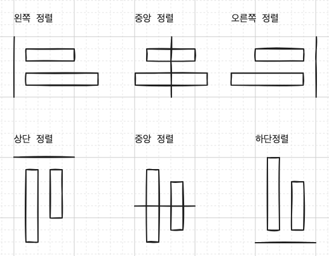
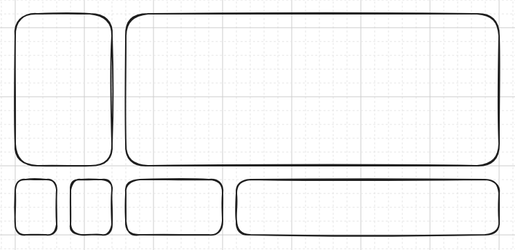
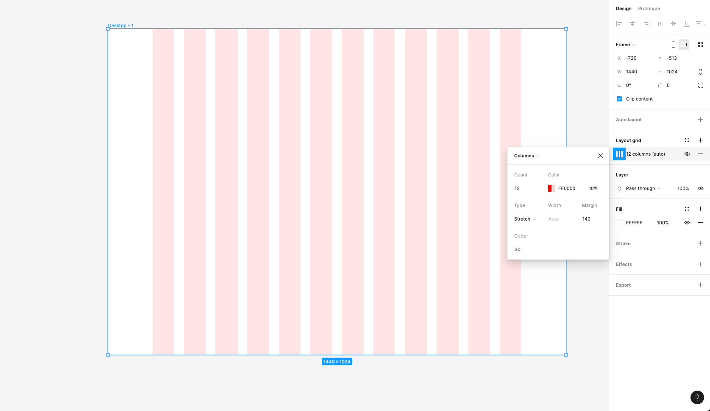
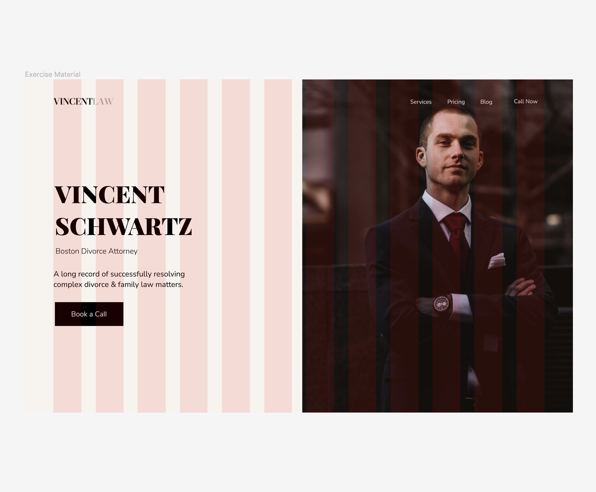

# 모든 것의 시작은 정렬과 그리드

- 우리는 혼란을 피하고 질서를 추구하기에, 정리된 방과 정리되지 않은 방의 차이 처럼,  
  물체를 정렬하면 구성이 더 좋아보이는 효과를 얻을 수 있다.

## 정렬

- 단순하고 기본적이지만, 가장 강력한 디자인 규칙

  - 개체를 정렬하는 여섯 가지 방법

    

    1. 왼쪽 정렬 - 서구권에서는 왼쪽에서 오른쪽으로 글을 읽어 나가기에, 객체를 정렬하는 가장 자연스러운 방법이다.

       - 왼쪽 모서리에서 객체를 살피기 시작하는 것은 우리 눈에 가장 자연스럽게 느껴진다.

    2. 중앙 정렬 - 주로 웹 디자인에서 자주 볼 수 있다.

    3. 오른쪽 정렬 - 아랍어, 히브리어 처럼 오른쪽에서 왼쪽으로 읽은 언어권에서 자연스러운 정렬이다.

    - 수평축에 물체를 정렬하는 세 가지 방법

    1. 상단 정렬

    2. 중앙 정렬

    3. 하단 정렬

## 그리드

- 그리드는 요소를 페이지에 인식 가능한 구조로 배치해서 정리하는 방법이다.

  - 그 중에서도 정말 좋은 디자인은 같은 크기로 나누어진 그리드이다.

    

    - 이 절차의 마지막 단계는 같은 값을 되도록 많이 재사용 하는 것이다.

- 그리드는 명료한 느낌을 준다.

  - 반복 되는 그리드 덕분에 예측 가능하고 친숙해 보일 수 있어, 이용자에게, 신뢰감을 줄 수 있다.

- 그리드 규칙은 유연하며, 언제니 그리드 규칙 내에서 디자인하지는 않는다.

  - 디자인 규칙을 어길 땐, 의도가 있어야 한다.

- 웹 디자인에서 가장 널리 사용되는 레이아웃은 12열 그리드이다.

  - 그 이유는 12는 3과 4의 배수이므로 12개의 열을 양쪽에서 6열씩 반으로 나눌 수도 있고,  
    가로 4열에 세로 3열로, 혹은 3열씩 4열로 나눌 수 있기 때문이다.

- 열 사이의 여백을 거터(Gutter)라 한다.

  

## 시각적 계층 구조의 중요성

시각적 계층 구조

- 자연스럽게 디자인으로 구성이 중요한 정보가 무엇인지 안내해주는 것을 시각적 계층구조라한다.

  - 시각적 계층 구조는 사람들의 관심이 작용하는 방식과 많은 관련이 있다.

    - 우리는 동시에 여러 대상에 집중할 수 없다.

    - 페이지의 주요 그래픽을 히어로 샷이라고 부른다.

- 계층 구조가 없으면 중요한 사항이 무엇인지 알기 어렵다.

- 좋은 계층 구조는 매우 독특한 초점과 요소들 사이에 명확하게 규정되어 있다.

- 거의 모든 웹 사이트의 히어로 섹션은 사용자의 3가지 질문에 대응할 수 있어야 한다.

  1. 이 웹사이트는 무엇에 관한 것인가?
  2. 이 웹사이트에서 무엇을 얻을 수 있는가?
  3. 그리고 어떻게 얻을 수 있을까?

  

## 착시현상

- 우리는 웬만해서 눈으로 본 걸 신뢰하게 된다.

  - 즉, 한 객체가 상대 객체보다 약간 작게 보이는 경우, 착시를 바로 잡고,  
    둘 다 같은 크기로 보일 때 까지 크기를 늘려야 함을 의미한다.
    - 보이는 크기가 실제 픽셀 크기보다 더 중요하다.

- 객체의 무게감

  - 무게감이 더 큰 물체가 더 커보인다.

- 눈대중으로 같은 크기로 느껴질 때 까지 확대한다.

- 때때로, 타이포그래피 간격에 따라, 중앙정렬이 좋지 않게 보일 수도 있다.

## 근접성

- 공통점을 가진 요소들을 서로 더 가깝게 묶는 게 좋은 디자인이며, 이러한 디자인 개념을 근접성이라고 한다.
  - 기본 관념은 관련이 있는 것으 가까이, 관련 없는 것을 멀리두어야 한다.
  - 근접성은 사용자가 쉽게 콘텐츠를 이해하고 소화할 수 있게 만든다.
