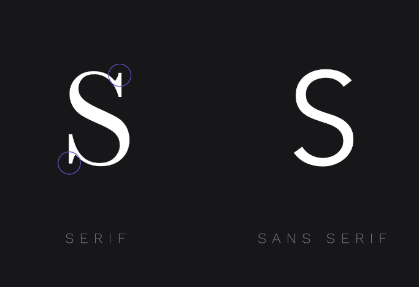
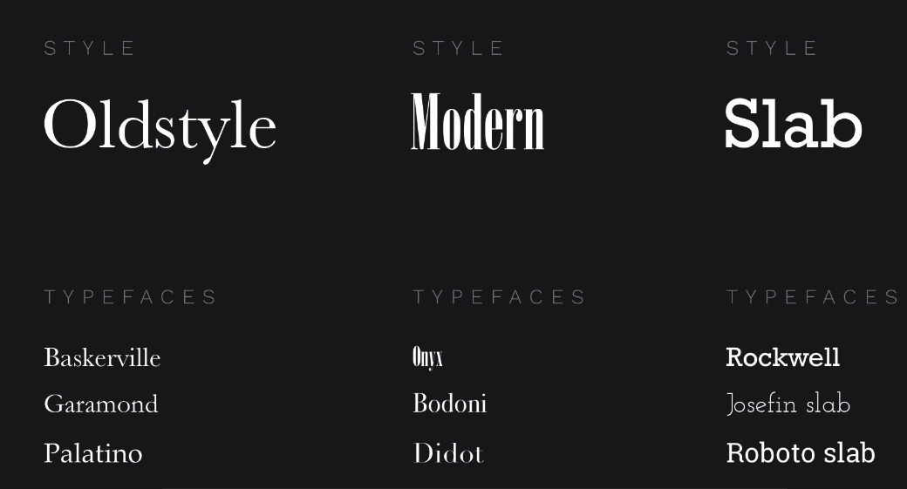

# 서체 소개

- 많은 디자인이 텍스트 스타일 선택 방식에 따라 달라지며, 이를 타이포그래피(Typography)라 한다.

  - 타이포그래피는 올바른 글꼴 선택만을 의미하지 않고, 글꼴의 조합을 선택하는 것을 의미한다.
    - 상황과 맥락에 적합한 글꼴과 서체를 선택해야한다.

- 서체라는 용어를 타입과 글꼴이라는 용어로 혼용하지만, 타입은 서체의 줄임말이다.

- 서체(Typeface)와 글꼴 차이

  - 타입은 서체의 줄임말이다.

    - Helvetica는 Light, Bold등과 같은 다양한 글꼴 스타일을 가진 서체 계열이다.

## 서체에는 성격이 있다.

1. 재미있고 장난스러운 서체
2. 엄격하고 무뚝뚝한 서체
3. 학문적이고 복잡한 서체도 있다.

- 글 꼴의 개성은 상황에 맞는 옷을 고르는 것 만큼이나 중요하다.

- 서체의 범주

  - 서체 대부분은 Serif, Sans Serif 범주에 속한다.

    

    - 위 사진의 글자 꼬리를 세리프라고 하며,
      프랑스어로 sans는 없음이라는 의미를 의미하여, Sans Serif는 serif 없음을 의미한다.
      이 두가지 광범위한 범주 외에도 장식이라고도 하는 Display와 Script라는 두 범주가 있다.

- Serif 서체는 세 가지 고유한 스타일이 있다.

    

  - Oldstyle은 Serif 서체 중, 가장 인기 있는 스타일이며, 가장 일반적으로 사용되는 스타일이다.
    - 대다수 책이 이 서체를 사용한다.
    - Oldstyle 서체는 이름 그대로 매우 고전적인 성격을 가지고 있어, 고급 레스토랑, 악기, 로펌 등과 같이 세련되고 고전적인 모습을 보여주 싶을 때 주로 사용한다.
    - 하지만, 한편으로 상당히 중립적일 수 있고 비고전적인 웹 사이트에서도 사용할 수 있다.
    - 높은 가독성을 제공한다는 점에서 특히 단락 텍스트에 어울린다.
  - Modern 서체는 Oldstyle과 상당히 유사하다.

    - Oldstyle은 Serif가 기울어져 있지만, Modern은 Serif가 반듯하며,
      두꺼운 부분과 얕은 부분은 부분의 극적인 대비가 있다.
    - Modern 유형은 패션 및 모든 호화 상품에 자주 사용되며, 꼭 여기에 국한되지는 않아, 진지하고 현대적이며 세련된 성격을 묘사하고 싶은 모든 대상에 사용할 수 있다.
    - 긴 텍스트에 적용하면 가독성이 좋지 않아 주로 제목과 큰텍스트에 사용한다.

  - Slab 서체는 상자 모양이다
    - 기계적이거나 강한 느낌을 줄 때 적합하다.
    - Modern과 같이 제목 용도로 쓰면 된다.

- 인쇄물은 일반적으로 화면보다 해상도가 높아, 글자의 작은 Serif는 낮은 해상도와 깜박임 때문에, 화면에서 보기 어려워,  
  웹에서 주로 Sans Serif를 사용하게 되었지만, 오늘 날 화면의 점점 더 고해상도로 변하면서 Serif글꼴이 다시 등장하고 있다.

- Sans Serif

  - 범용성이 높아, 다양한 개성을 가진 디자인에 맞출 수 있어 자주 접하게 된다.
  - 가벼움과 부드러움부터 진지함과 보수성까지 다양한 성격을 담을 수 있다.
  - Sans Serif 서체의 성격을 일반화 한다면, 현대적이고 진지하며 중립적인 느낌을 지닌다고 말할 수 있다.

  

- Display 혹은 Decorative 서체는 일반적으로 강한 성격을 가진 서체이다.

  - Display는 성격이 다양하기에, 웬만해선 사용을 자제하는 게 좋다.
    - 하지만, 때로는 좀 더 중립적이고 우아한 스타일로 보이기도한다.

- Script 서체는 필기체를 바탕으로 한다.
  - 육아용 웹 사이트를 디자인할 때 주로 쓰인다.

## 서체 설정

- letter spacing

  - 간격을 크게 넒힌 걸 파노라마라 한다.
    - 이미 제목이 있는 텍스트 블록에 추가 제목을 넣어야 하는 경우, 파노라마로 부제를 설정할 수 있다.
      - 부제를 파노라마로 설정하면, 원래 제목에 대한 집중도를 저해하지 않을 수 있다.
      - 파노라마 서체 설정은 가독성을 잃지 않으며, 글꼴을 매우 작은 크기로 줄일 수 있다.
      - 파노라마를 사용할 때, 대문자를 사용하는 것이 효과적이다.
  - 좁은 간격은 크고 두꺼운 텍스트를 다룰 때 사용한다.

  - 줄 간격을 늘리면, 가독성에 좋은 영향을 준다.
    - 사람들은 대부분 웹 사이트에서 텍스트 전문을 읽는 게 아니라 훑어 보기 때문에, 더욱 효과를 가질 수 있다.
      - 기본 줄 높이는 특정 글꼴 크기에서 34px이다.
  - 매우 굵은 글씨를 다룰 때, 특히 대문자를 사용할 땐 줄 간격을 줄이는 게 좋다.

  - 어두운 배경의 Regular 흰색 텍스트가 더 진하게 보일 때가 있다. 이러한 착시 현상을 굵기를 조절해 보정할 수 있다.

  - 글꼴 크기를 늘릴 수록 무게감이 커진다.

  - 비슷한 무게감에 다른 크기로 표현할 때, Light 스타일과 Reqular 스타일을 고려해볼만하다.
    - 4종류의 굵기면 충분하다.

## 글꼴은 두 개면 충분하다.

- 글 종류가 많으면 보기 버거워지며, 두 개만으로 표현하고자 하는 성격을 보여줄 수 있다.
- 너무 유사한 서체를 사용하면, 클릭 실수로 글골을 잘못 선택한 것 처럼 느낄 수 있다.
- 목적성 부여는 디자인을 보기 좋게 만드는 최고의 방법 중 하나이다.

- 중립적인 것을 원할 때 Sans Serif 스타일을 사용한다.

- 무엇에 집중 하느냐에 따라, 굵기 종류가 많은 Open Sans, Roboto, Muil 등을 고려할 수 있다.
