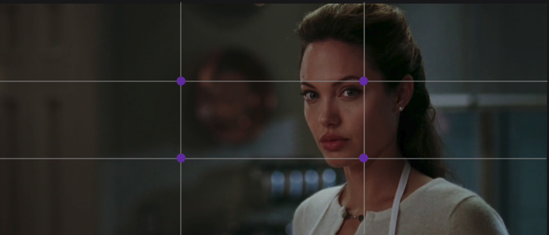
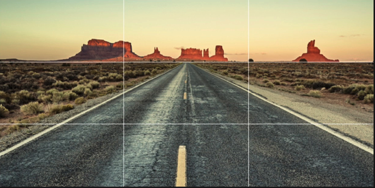
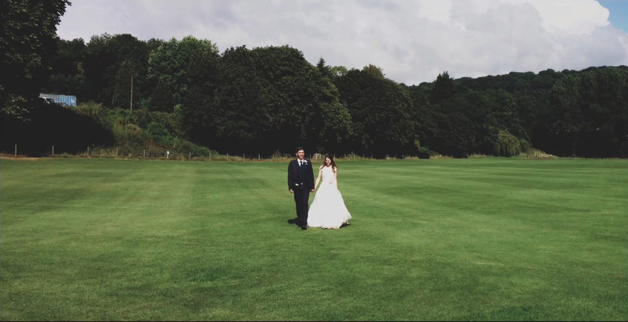

# 사진

- 대비가 낮아서 텍스트를 거의 읽을 수 없을 때 오버레이를 사용해 사진을 어둡게 하는 것이 좋다.

  - 전체 페이지 대신 특정 위치에만 적용할 수도 있다.

## 사진 자르는 법

- 익스트림 크롭

  - 이미지를 감질 맛나게 확대하는 것
  - 익스트림 크롭의 핵심은 물체를 알아볼 수 없을 정도로 너무 심하게 하지 않는 것이다.

- 소프트 크롭

  - 윤곽이 선명하지 않고, 이미지가 점차 희미해진다.
    - 이 작업은 일반적으로 이미지 위에 희미해지는 오버레이를 추가하는 방식으로 진행된다.

## 3등분 법칙

- 영화에서 배우들이 종종 프레임의 중심에서 벗어나는 경우가 있다.

  - 영화 제작자와 사진작가는 잠연에 시각적 흥미를 더하기 위해 3등분 법칙이라는 기법을 사용한다.

  

  - 화면을 수직 수평으로 3등분 하면 선의 교차점은 시각적으로 가장 흥미롭게 피사체를 배치할 수 있는 지점이된다.
    - 만약 피사체가 안젤리나 졸리만큼 크다면, 피사체를 모든 수직선에 걸쳐 놓아야한다.

 

- 위의 풍경 사진이라면, 수평선 중 하나에 지평선을 놓아야한다.

- 사점에 주제를 두면 뭔가 예상 되는 느낌을 줄 수 있다.
  - 대칭적이고, 그 주변 공간이 균일하며, 안정적이고 편안하다.

 

- 피사체가 중심에서 벗어나면 긴장감이 생긴다.

  - 눈은 항상 가장 먼저 보는 부위이며, 모든 얼굴의 초점이니, 항상 눈을 지침으로 활용한다.

- 대상과 기타요소를 배치할 때 대상을 중앙으로 두면, 시각적 관심을 불러온다.

## 네모에서 벗어나기

- 네모난 이미지를 바로 캔버스에 올리면, 인상적이지 않을 때가 많다.

- 이미지의 틀을 제거하여 깊이를 더하고 다른 레이어로 개체를 존재시킬 수 있다.

## 전문가 처럼 사진 선정하기

2가지 질문에 답하는 것이 좋다

1. 사진의 장면은 진짜인가?

2. 사진 속 인물의 감정이 진짜인가?
