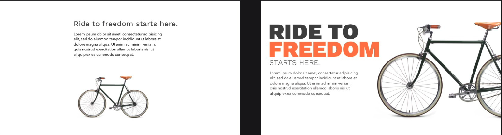

# 디자인 비법

## 대비

- 큰 제목과 단락의 작은 텍스트, 제목의 묵직함과 단락의 가벼움도 대비가 된다.

- 대비는 가장 많이 사용되는 트릭이며, 요소 간 시각적 계층도 형성한다.

  - 대비는 크게 3가지 요소로 나눌 수 있다.

    - 색상, 크기, 무게감

  - 디자인에 흥미 요소를 줄 아이디어가 없을 때 대비는 좋은 선택이다.

  

## 여백

- 여백은 객체 주변의 공간으로 객체에 집중하게 하는 효과를 가진다.

  - 여백이 무조건 흰색일 필요는 없다.

  - 여백이 많아 불평하는 사용자는 없지만, 복잡한 페이지를 싫어하는 사용자는 많다.

- 서로 연관되거나 맥락이 같은 요소는 가깝게 붙어야 한다.

## 반복

- 단독일 때는 별로지만, 여러번 반복하면, 흥미로운 결과를 얻을 수 있다.

  - 색상, 스타일, 간격 레이아웃 등 모든 것에 적용할 수 있으며, 디자인에 통일성을 줄 수 있다.

- 인간은 모든 관찰 대상에서, 패턴을 찾아내고, 패턴을 찾으면 쾌감을 느낀다.

- 디자인에 적용되는 물리 법칙은 없다. 완전히 인간 중심적이다.

## 일관성

- 좋은 디자인을 구분하기 가장 쉬운 방법은 일관성이다.

  - 일관성이 있는 나쁜 디자인이, 일관성이 없는 좋은 디자인보다 낫다.

  - 일관성은 비법보다 디자인 원칙에 가깝다.

- 그리드가 필요한 이유는 레이아웃의 일관성을 주는 방법이다.
  - 특정 배열을 반복하면, 사용자는 계속 같은 방식의 레이아웃에 노출되며 기대하게 된다.  
    기대감을 충족하면 사용자의 경험은 즐거워지며, 사이트를 더 신뢰하게 된다.

## 겹치기

- 두 개의 독립된 요소를 하나로 묶는 것을 의미한다.

- 겹치기를 사용하면 디자인을 흥미롭고, 구성에 입체감을 만들 수 있다.

  - 밋밋한 요소에 겹치기를 추가하면 재미가 추가된다.

- 다만 겹치기는 그리드를 해친다. 하지만 의도가 있기에 괜찮다.

## 긴장감

- 배치 혹은, 기울기등을 조절해 요소에 긴장감을 줄 수 있다.

- 익스트림 크롭은 긴장감을 더욱 커지게 만드는 방법이다.

- 3등분의 법칙이 통하는 이유도, 같은 맥락이다.
